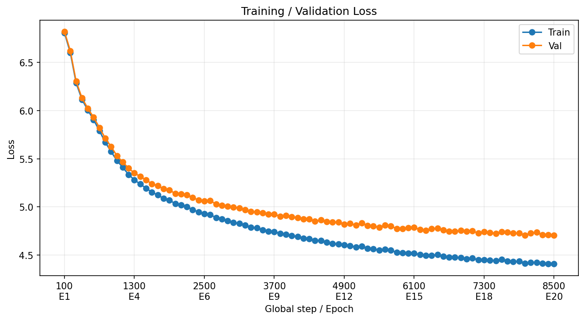
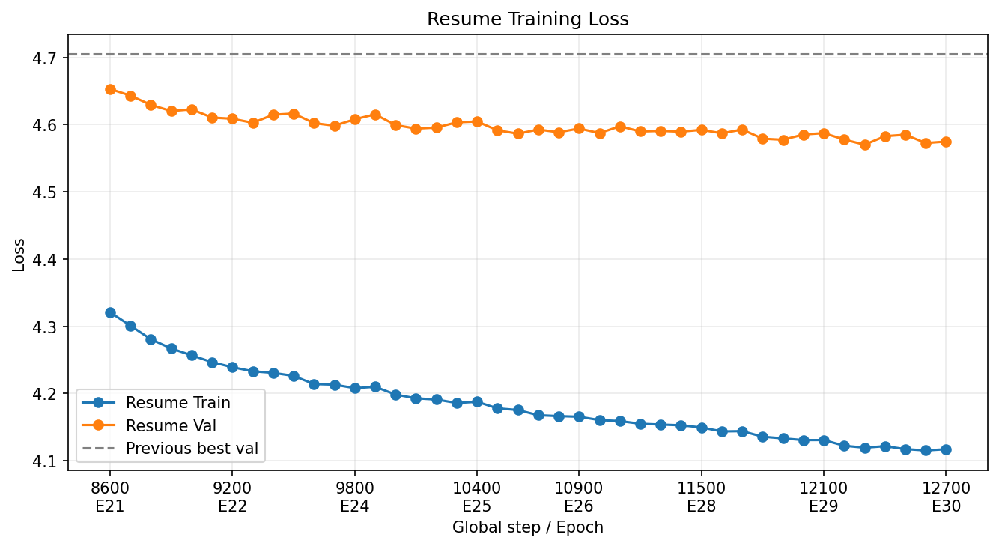

# mini GPT 구현 과제 보고서

## 0. 팀 정보

| 항목 | 내용 |
| --- | --- |
| 과정/강의실 | SW-AI 302호 |
| 팀 | 2조 |
| 팀원 | 염태선, 위승철, 김규민, 이준희 |
| 구현 방식 | 개별 담당 파트 없이 팀원 모두가 함께 구현 |

## 1. 구현 현황

| 파일 | 주요 구현 내용 | 담당 |
| --- | --- | --- |
| `src/bpe.py` | byte 기반 BPE tokenizer, save/load, encode/decode | 팀원 모두 |
| `src/dataset.py` | GPT 사전 학습용 sliding window Dataset/DataLoader | 팀원 모두 |
| `src/embedding.py` | token embedding, position embedding, dropout | 팀원 모두 |
| `src/attention.py` | causal multi-head self-attention | 팀원 모두 |
| `src/model.py` | GELU, LayerNorm, FeedForward, TransformerBlock, GPTModel | 팀원 모두 |
| `src/train.py` | loss 계산, 학습 루프, 생성 함수, checkpoint 저장/복원 | 팀원 모두 |
| `src/finetune.py` | 감성 분류 미세 조정 코드 | 팀원 모두 |

## 2. 테스트 통과 현황

| 테스트 파일 | 결과 |
| --- | --- |
| `tests/test_bpe.py` | PASS |
| `tests/test_dataset.py` | PASS |
| `tests/test_embedding.py` | PASS |
| `tests/test_attention.py` | PASS |
| `tests/test_model.py` | PASS |
| `tests/test_train.py` | PASS |
| `tests/test_finetune.py` | PASS |

전체 테스트를 실행했을 때 실패한 테스트는 없었다.

## 3. 데이터

| 항목 | 내용 |
| --- | --- |
| 데이터셋 | NSMC |
| 원본 데이터 | `ratings_train.txt`, `ratings_test.txt` |
| 언어 모델 학습 데이터 | `data/nsmc_lm_train.txt` |
| 언어 모델 검증 데이터 | `data/nsmc_lm_val.txt` |
| 감성 분류 학습 데이터 | `data/nsmc_sentiment_train.jsonl` |
| 감성 분류 검증 데이터 | `data/nsmc_sentiment_val.jsonl` |
| 감성 분류 테스트 데이터 | `data/nsmc_sentiment_test.jsonl` |

### 전처리 방식

NSMC 원본 TSV 파일에서 `document`, `label` 컬럼을 읽었다. 문장이 비어 있는 데이터는 제외했고, label은 `0`, `1`만 사용했다.

텍스트는 공백을 정리하는 방식으로 전처리했다.

```python
text = re.sub(r"\s+", " ", text).strip()
```

즉, 여러 개의 공백과 줄바꿈은 하나의 공백으로 정리하고, 앞뒤 공백은 제거했다.

NSMC 원본 데이터에는 리뷰 텍스트와 감성 label이 함께 들어 있다.  
사전 학습용 LM 데이터는 다음 토큰 예측이 목적이므로 label은 사용하지 않고 리뷰 텍스트만 모아 `nsmc_lm_train.txt`, `nsmc_lm_val.txt`로 저장했다.  
반면 감성 분류 미세조정용 데이터는 긍정/부정 label이 필요하므로 `text`, `label`을 함께 담은 JSONL 파일로 저장했다.

| 항목 | 값 |
| --- | --- |
| LM train chars | 1,379,486 |
| LM val chars | 120,560 |
| 감성 분류 train rows | 137,996 |
| 감성 분류 val rows | 11,999 |
| 감성 분류 test rows | 49,997 |

## 4. BPE Tokenizer

| 항목 | 내용 |
| --- | --- |
| 최종 vocab size | 3000 |
| BPE 학습 corpus 크기 | 1,500,000 chars |
| vocab 파일 경로 | `data/nsmc_bpe_vocab_3000.json` |
| 로컬 BPE 학습 시간 | 약 8분 |
| Colab BPE 학습 시간 | 약 31분 |

### Vocabulary 구성

| 범위 | 의미 |
| --- | --- |
| `0~3` | special token |
| `4~259` | byte token |
| `260~` | BPE merge token |

Special token은 다음과 같이 고정 ID를 사용했다.

| token | id |
| --- | --- |
| `<pad>` | 0 |
| `<unk>` | 1 |
| `<bos>` | 2 |
| `<eos>` | 3 |

### Encode/Decode 복원 확인

예시 문장:

```text
이 영화는 정말 좋았다! English 123
```

`encode()`로 token id 리스트로 변환한 뒤 `decode()`를 수행했을 때 원문 복원에 성공했다.

## 5. 모델 구조

최종 사전 학습에 사용한 GPT 모델 구조는 다음 흐름으로 구성했다.

```text
token id
-> token embedding + position embedding
-> TransformerBlock x n_layers
-> final LayerNorm
-> LM Head
-> vocab 전체에 대한 logits
```

### 최종 모델 Config

| 항목 | 값 |
| --- | --- |
| `vocab_size` | 3000 |
| `context_length` | 64 |
| `emb_dim` | 192 |
| `n_heads` | 8 |
| `n_layers` | 2 |
| `drop_rate` | 0.2 |
| `qkv_bias` | False |

### 구조 요약

| 구성 요소 | 역할 |
| --- | --- |
| InputEmbedding | token id를 벡터로 바꾸고 위치 정보를 더함 |
| MultiHeadAttention | 현재 토큰이 이전 토큰들을 참고해 문맥 정보를 반영함 |
| FeedForward | 각 토큰 벡터를 더 복잡한 특징 표현으로 가공함 |
| LayerNorm | 벡터 값의 분포를 안정화해 학습을 돕는 정규화 |
| Residual Connection | 원래 입력 정보를 보존하면서 attention/FFN 결과를 더함 |
| LM Head | 각 위치의 벡터를 vocab 전체 token 점수로 변환함 |

```text
token embedding: 3000 x 192
position embedding: 64 x 192
TransformerBlock 2개
final LayerNorm
lm_head: 192 x 3000
최종 모델의 파라미터 수는 약 2.05M개이다.
```

## 6. 사전 학습

### 학습 설정

| 항목 | 값 |
| --- | --- |
| 데이터 | NSMC LM corpus |
| vocab size | 3000 |
| context length | 64 |
| batch size | 32 |
| optimizer | AdamW |
| epoch | 30 |
| 학습 방식 | epoch 20까지 학습 후 checkpoint에서 resume |
| BOS/EOS 사용 | 리뷰 단위 경계를 위해 각 line encode 시 BOS/EOS 사용 |

### 1차 학습: Epoch 1~20

처음에는 learning rate를 크게 가져가 빠르게 loss를 낮추는 방향으로 학습했다.

| 항목 | 값 |
| --- | --- |
| run name | `20260603_063150_pretrain_ctx64_bos_emb192_heads8_layers2_drop0.2_bs32_lr0.01_ep20` |
| learning rate | 0.01 |
| epoch | 20 |
| global step | 8500 |
| train tokens | 869,883 |
| val tokens | 76,010 |
| final train loss | 4.4088 |
| final val loss | 4.7053 |
| best val loss | 4.7053 |

학습 곡선:



### 2차 학습: Epoch 21~30

epoch 20 이후 같은 learning rate로 계속 학습했을 때 과적합이 늘고 학습이 불안정해지는 경향이 있었다. 그래서 epoch 20 checkpoint를 기준으로 다시 불러온 뒤, learning rate만 낮춰서 epoch 30까지 이어서 학습했다.

| 항목 | 값 |
| --- | --- |
| run name | `20260603_065413_resume_from_ep20_to_ep30_ctx64_bos_emb192_heads8_layers2_drop0.2_bs32_lr0.003_wd0.01` |
| resume checkpoint | epoch 20 checkpoint |
| learning rate | 0.003 |
| weight decay | 0.01 |
| 추가 epoch | 10 |
| 최종 epoch | 30 |
| 최종 global step | 12700 |
| final train loss | 4.1170 |
| final val loss estimate | 4.5750 |
| final full val loss | 4.5626 |
| best val loss estimate | 4.5703 |

Resume 학습 곡선:



### 학습 전략 요약

처음부터 낮은 learning rate로 학습하면 안정적이지만 loss가 천천히 줄어든다. 반대로 learning rate를 크게 두면 빠르게 학습할 수 있지만, 후반부에는 튀거나 과적합이 커질 수 있다.

이번 실험에서는 epoch 20까지는 큰 learning rate로 빠르게 학습하고, 이후에는 checkpoint를 기준으로 learning rate를 낮춰 이어서 학습했다. 그 결과 validation loss를 추가로 낮출 수 있었다.

### Checkpoint

| 항목 | 경로 |
| --- | --- |
| epoch 20 checkpoint | `/content/drive/MyDrive/W14-gpt-lab/runs/20260603_063150_pretrain_ctx64_bos_emb192_heads8_layers2_drop0.2_bs32_lr0.01_ep20_BESTSOFAR/checkpoints/ckpt_epoch_20.pt` |
| resume run directory | `/content/drive/MyDrive/W14-gpt-lab/runs/20260603_065413_resume_from_ep20_to_ep30_ctx64_bos_emb192_heads8_layers2_drop0.2_bs32_lr0.003_wd0.01` |

## 7. 미세 조정


| 항목                         | 내용                     |     |
| -------------------------- | ---------------------- | --- |
| 구현 파일                      | `src/finetune.py`      |     |
| 과제                         | NSMC 리뷰 긍정/부정 분류       |     |
| 데이터 포맷                     | JSONL, `text`, `label` |     |
| max_length                 | 128                    |     |
| batch_size                 | 16                     |     |
| backbone learning rate     | 0.00001                |     |
| classifier learning rate   | 0.0001                 |     |
| validation loss / accuracy | 0.4371 / 79.64%        |     |
| test loss / accuracy       | 0.4406 / 79.41%        |     |


## 8. 실험 환경

| 항목 | 내용 |
| --- | --- |
| Python | 3.11 |
| PyTorch | 2.12.0+cpu |
| 로컬 환경 | Windows, `.venv` |
| Colab 환경 | Google Colab |
| GPU | Colab T4 GPU |

로컬과 Colab GPU 환경을 함께 사용했다. BPE 학습과 모델 사전 학습은 Colab GPU 환경을 주로 사용했고, 구현 및 테스트는 로컬 환경에서도 확인했다.

## 9. 고찰


### 어려웠던 점

Colab GPU 사용량에 제한이 있어 장시간 학습을 안정적으로 이어가기 어려웠다. 특히 여러 하이퍼파라미터 조합을 반복해서 실험해야 했기 때문에, 한 계정의 GPU 사용량만으로는 실험을 충분히 돌리기 어려운 상황이 있었다.

구현해야 하는 범위도 넓었고 하이퍼파라미터를 조정하면서 실험하는 부분도 범위가 넓었다. 
네 명이 각각 구현했지만 코드도 다 구현하고 하이퍼파라미터 조정까지 하기에는 시간 대비 최대 효율을 내는 데 어려움이 있었다.

또한 처음에는 하이퍼파라미터를 바꿔 실험할 때마다 같은 corpus를 다시 tokenizer로 encode하는 과정이 반복되었다. 모델 학습 자체뿐 아니라 token id를 만드는 과정도 시간이 걸렸기 때문에, 실험을 빠르게 반복하기 어려웠다.

### 해결한 방법

Colab GPU 제한 문제는 여러 환경을 번갈아 사용하면서 해결했다. 로컬에서는 구현과 테스트를 확인하고, 무거운 학습은 Colab GPU를 사용했다. GPU 사용량이 제한될 때는 다른 계정/런타임을 활용해 학습을 이어갔다.

반복되는 tokenizer encode 시간은 token cache를 저장하는 방식으로 줄였다. 한 번 만들어진 token id tensor를 Google Drive cache 경로에 저장해두고, 이후 하이퍼파라미터만 바꾸는 실험에서는 다시 encode하지 않고 cache를 불러오도록 했다. 덕분에 같은 vocab/corpus 설정에서는 학습 셀을 더 빠르게 반복 실행할 수 있었다.


### 개선하고 싶은 점

이번 실험에서는 train loss와 validation loss를 낮추는 데 집중하다 보니, 실제 생성 샘플의 자연스러움을 충분히 비교하지 못했다. 이후에는 같은 checkpoint에서도 `temperature`, `top_k` 같은 생성 파라미터를 조절하면서 문장이 얼마나 자연스럽고 다양하게 생성되는지 함께 평가해보고 싶다. loss가 낮아도 생성 결과가 항상 좋은 것은 아니기 때문에, 정량 지표와 샘플 품질을 같이 보는 방향으로 개선할 수 있다.


